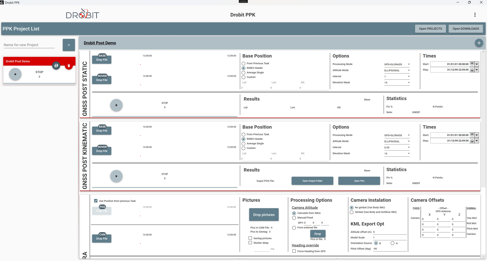

# Drobit PPK

An open-source, intuitive desktop application for post-processing GPS/GNSS RTK data from drones and aircraft. Chain processing steps together in a visual workflow to go from raw GNSS observations to precisely geotagged camera positions.



> This software was originally developed as the companion tool for the [Drobit Hardware](https://github.com/wjax/Drobit-HW) project (discontinued). It now works as a standalone PPK processing suite for any compatible GNSS data.

## What It Does

Drobit PPK provides a project-based workflow where you define a sequence of **jobs** that execute in order, with each job's output feeding into the next. This lets you build complete post-processing pipelines with just a few clicks and drag-and-drop file inputs.

### Three Core Job Types

**1. GNSS Post Static** — Base Station Coordinate Refinement

Computes the precise coordinates of your PPK base station from static GNSS observations. Uses RTKLIB's `rnx2rtkp` engine under the hood with support for GPS+GLONASS constellations, configurable elevation masks, and ellipsoidal or geoid (EGM96) altitude modes. The refined base position feeds directly into the next job.

**2. GNSS Post Kinematic** — Flight Path RTK Processing

Post-processes the rover's (drone's) kinematic GNSS data against the base station to produce a centimeter-accurate flight trajectory. Supports multiple base position sources: output from a previous static job, RINEX header coordinates, averaged single-point position, or manual entry. Outputs position solutions with fix quality indicators (Fix / Float / Single).

**3. Camera Processing** — Geotagging & Camera Position Calculation

Interpolates precise camera positions along the RTK trajectory using timestamps and spline interpolation. Applies coordinate transformations (WGS84 LLA <-> ECEF <-> NED <-> Body Frame) to account for GPS antenna-to-camera offsets, IMU orientation (roll/pitch/yaw), and gimbal mount geometry. Outputs geotagged images (EXIF), camera position files, and 3D KML visualizations for Google Earth.

## Powered by RTKLIB

At the heart of the GNSS post-processing is [RTKLIB](http://www.rtklib.com/), an open-source program package for standard and precise GNSS positioning. Drobit PPK wraps RTKLIB's command-line tools (`rnx2rtkp`, `convbin`, `crx2rnx`, `rtkplot`) with an intuitive UI, managing configuration, file conversion, and result parsing so you don't have to work with RTKLIB directly. The bundled tools are included in the `Utils/` folder.

## Key Features

- **Visual job pipeline** — Drag-and-drop files, chain jobs, run with one click
- **Project management** — Save/load processing projects (`.prj` files) for reuse
- **Multiple input formats** — RINEX 2.x/3.x, u-blox UBX, Topcon TPS, Drobit GNSS, DJI MRK, compact RINEX
- **Camera mount support** — Fixed body-mount and multi-axis gimbal configurations with full offset calibration
- **KML 3D export** — Visualize camera positions and orientations in Google Earth with embedded 3D models
- **Photo geotagging** — Write computed coordinates directly into JPEG EXIF metadata
- **Accuracy classification** — Positions tagged as Fix, Float, or Single quality
- **Auto UBX trigger detection** — Automatically extracts camera events from u-blox time-mark data
- **Configurable processing** — Elevation masks, time ranges, processing intervals, constellation selection

## Requirements

- Windows (WPF application)
- .NET Framework 4.8
- Visual Studio 2019+ (for building from source)

## Building

```bash
# Clone the repository
git clone https://github.com/wjax/DrobitPPK.git

# Open in Visual Studio
# Build > Build Solution (Ctrl+Shift+B)

# Or via command line
msbuild ControlCenter.sln /p:Configuration=Release /p:Platform="Any CPU"
```

The build output includes the required RTKLIB utilities (`rnx2rtkp`, `convbin`, `crx2rnx`, `rtkplot`) bundled in the `Utils/` folder.

## Typical Workflow

```
1. Create a new project
2. Add a GNSS Post Static job
   └── Drop your base station RINEX files (base + rover)
   └── Configure processing options
3. Add a GNSS Post Kinematic job
   └── Check "Use Position from Previous Task" for the base
   └── Drop your rover flight RINEX/UBX file
4. Add a Camera Processing job
   └── Drop your CAM/MRK file and photos
   └── Set camera mount offsets and orientation source
5. Hit Play — jobs execute in sequence
6. Review results: .pos files, geotagged images, KML visualization
```

## Project Structure

| Project | Description |
|---------|-------------|
| **ControlCenter** | Main WPF application (UI, ViewModels, Processing Engines) |
| **GNSSProcessingLibrary** | Core GNSS data structures and parsing |
| **Communications** / **CommsDataTypes** | Communication protocols and data types |
| **DrobitDataModel** | Shared data model |
| **WExtraControlLibrary** | Custom WPF controls (progress bars, LEDs, maps) |
| **DrobitExtras** | Utility library (process execution, helpers) |
| **ExifManipulationLibrary** | JPEG EXIF metadata manipulation via Magick.NET |
| **AutoUpdater.NET** / **ZipExtractor** | Application auto-update mechanism |

## License

This project is open source. See the repository for license details.

## Origin

Drobit PPK was originally built as the desktop companion for the [Drobit Hardware](https://github.com/wjax/Drobit-HW) PPK system for drones. While the hardware project has been discontinued, this software continues as a standalone open-source PPK processing tool.
